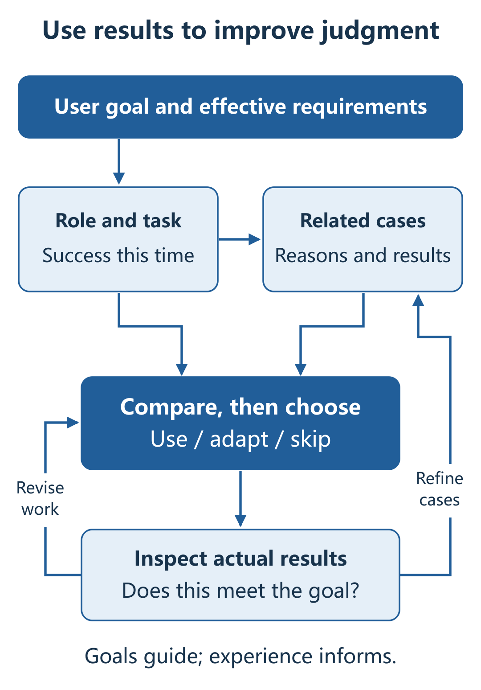
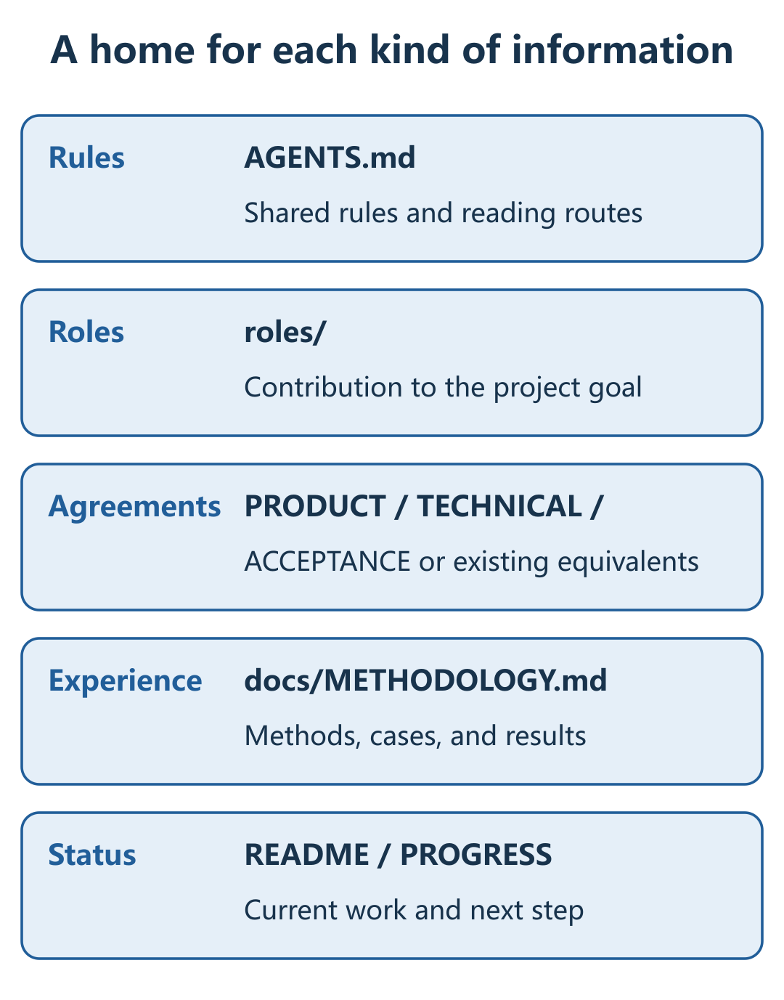

[English](README.md) · [繁體中文](README.zh-Hant.md) · [简体中文](README.zh-CN.md)

**Codex · Astra** | **v0.5.24** | **MIT**

[Install latest](#start) · [Update](#update) · [Use](#use) · [Change history](CHANGELOG.md) · [How it works](#loop) · [Feedback](#feedback)

**Team Leader is an AI team working method packaged as a Skill. It organizes work around your goal, corrects results through feedback, connects project leads directly, and brings experience into the next decision.**

You set the goal and important tradeoffs; the lead takes responsibility for coordination and delivery. The aim is to reduce repeated progress checks, message relaying, and teaching from scratch, making ongoing collaboration more useful and responsive to your needs.

## Three connected responsibilities

- **Carry work through toward the goal.** Clarify each role's contribution, compare actual results with requirements, coordinate corrections, and check the revised result.
- **Connect the right project leads.** Coordinate specialists within a project and contact suitable existing leads in other projects. Exchange questions and context, then apply their contributions to the current task.
- **Build experience and use it again.** Keep the conditions, reasons, and results. Retrieve similar cases, compare conditions before adapting a method, and revise the experience when new results warrant it.

Together, these support complete delivery across continuing projects, research, reports, and practical work. Simple tasks can remain solo. Cross-project communication requires host tools and appropriate access. Better ongoing collaboration is a design aim; long-term outcomes still need broader evidence.

[Read the complete design article: collaboration, feedback, and experience](https://aidesign996.github.io/ai-practice/article-team-leader.html)

**Current formal release: [0.5.24](https://github.com/aidesign996/team-leader/releases/latest) · 2026-09-11.** Recover actual unfinished work, bring case conditions into real decisions, reuse valid authorization, and check the complete result after changes. [Changes and upgrade requirements](CHANGELOG.md).

## Install the latest release

Give this instruction to an AI tool with web and file access:

> Read https://github.com/aidesign996/team-leader, check the latest stable release at https://github.com/aidesign996/team-leader/releases/latest, and install its complete Team Leader Skill package. Tell me the version actually installed.

The host must support installing and reading Skills. Complete any required permissions or settings when prompted. Use the formal release ZIP, not the development branch or only `SKILL.md`.

Manual installation

1. Open the [latest formal release](https://github.com/aidesign996/team-leader/releases/latest). Under Assets, download `team-leader-VERSION.zip` and extract the complete `team-leader` folder.
2. Put it in your personal `~/.agents/skills/` or the project's `.agents/skills/`, preserving references, templates, and relative paths. Avoid an extra nested folder.
3. Select Team Leader or mention `$team-leader` in a project conversation. Confirm that it can read the version in `SKILL.md`; reopen the conversation or restart Codex if it is not discovered. This release includes 21 Skill files and an MIT license.

## Already installed? Update it explicitly

**Publishing a release does not automatically update your installed Skill.**

> Check Team Leader's latest formal release. Back up the old package and custom changes, then update the complete Skill. Preserve project records, accepted decisions, and unfinished work. Check the installed version, have the existing lead adopt relevant changes, and continue toward the original goal.

Read the [change history](CHANGELOG.md) since your installed version, including impact and upgrade requirements. Compare custom changes before merging them. Installation and the rules actually adopted by a project are separate states; record adoption after migration.

## Hand over the project in one sentence

Select Team Leader or mention `$team-leader` in your project conversation, then say:

> Please take responsibility for this and keep it moving. Retain useful experience as we go; when something similar comes up, look it up and consider how to use it.

The lead should recover the goal, existing context, and unfinished work, then arrange the next step. It asks for essential missing requirements while you focus on making the result better.

**Reuse an appropriate existing professional owner, including a lead in another project.**

Cross-project work requires communication tools and access to the necessary materials. When a new team is needed, ask: “Please establish the complete team for this project and coordinate its work.” With authorization, establish six visible responsibilities and activate those needed for each task. Suitable solo work can deliver a complete result; existing professional ownership remains in place.

## Two kinds of feedback: correction and experience

The design draws on feedback in *Thinking in Systems*. The two loops have different roles:

- **Balancing feedback checks results against the goal.** The lead identifies gaps, coordinates specialist corrections, and checks the updated result.
- **Reinforcing feedback supports further learning from experience.** Accumulated experience informs refinement and validation; newly established useful experience adds to that accumulation. Filtering and revision matter, since mistaken interpretations can also be reinforced.

The diagram above shows balancing feedback: it helps close the gap between the goal and the result.

The reinforcing loop above serves a different purpose: accumulated experience informs refinement and validation, and newly established useful experience adds to that accumulation. Both are working-method concepts, not a calibrated system dynamics model or a claim of automatic capability growth.

Early work can explore alternatives before selecting an implementation against goals and constraints. The lead needs to inspect real outputs; a completion report alone cannot establish that the goal has been met.

## Let experience inform the next decision

### Compare conditions before choosing an approach

Start a new task by recovering the user goal, role responsibilities, and effective requirements, then retrieve related cases. Compare why an earlier choice was made and what is different now; decide whether to reuse, adapt, or skip the old method.

The two return paths serve different purposes: **correct current work if the problem remains; refine the original experience when there is a new finding.** User feedback and the AI's actual attempts can both provide evidence. Unverified explanations remain hypotheses.

For example, making an article easy to understand is the goal; paragraph breaks and bold text are possible methods. A buried point may need its own paragraph and a little emphasis. If almost everything is bold next time, less emphasis may help. The same goal can lead to different choices. This illustrates reasoning, rather than reporting an effectiveness experiment.

### Give each kind of information a stable home

The Skill specifies how to read and update knowledge; project files hold the content. Effective requirements and case experience have separate homes connected by references. The lead retrieves what is relevant to the current problem.

`AGENTS.md`: shared rules and when to read related materials. 
`roles/`: each role's responsibilities and contribution to the overall goal. 
Product, technical, and acceptance documents: confirmed requirements and decisions. 
`docs/METHODOLOGY.md`: an experience entry point linking methods, cases, and results. 
`README.md`, `PROGRESS.md`, and equivalents: current status, unfinished work, and next steps.

The diagram shows the supplied templates; existing projects can keep their own effective entry points. Cases retain conditions, reasons, actual results, and limits of applicability. Update the original record when new evidence arrives; unrelated or duplicate material need not become another entry.

**Goals and effective requirements are binding; old cases can be adapted.** A one-time requirement applies to that task without automatically becoming a permanent rule. Saving files must be followed by actual retrieval, comparison, and use. This does not retrain the model or guarantee omission-free behavior over time.

## One lead, five specialist responsibilities

| Role | Responsibility |
| --- | --- |
| **0 · Team Leader** | Organize work around the user goal, identify gaps, and coordinate delivery. |
| **1 · Environment setup** | Prepare and check reproducible working conditions. |
| **2 · Product design** | Clarify needs, workflows, and user experience. |
| **3 · Technical design** | Define architecture, interfaces, and implementation boundaries. |
| **4 · Development** | Build, self-check, and correct. |
| **5 · Independent AI review** | Check results through a role that did not produce that work. |

In team mode, establish all six visible responsibilities when authorized, then activate the roles needed for each task. Map these responsibilities to the actual deliverable, including research, assessments, reports, and services. The lead also organizes requirements, product and technical decisions, progress, and experience into findable project documents. Records must be read and applied in later work; saving them alone is not automatic memory.

## Fit and effort

- **Primarily designed around Astra in Codex.** Sol has some specialist-role experience, but there is no comparable evaluation of a complete Sol team.
- **Multi-role work can use substantial quota.** Explicit user model and effort choices come first. When automatic allocation is authorized, the lead usually starts at high; specialist effort follows complexity and checks stay proportionate to actual risks.
- **Simple tasks can remain solo.** Package integrity, extraction into a clean directory, and basic structure were checked. A complete first run on a new account, long-term correction, and quota savings have not been evaluated systematically.

[Read the full design article on GitHub](https://github.com/aidesign996/ai-practice/blob/main/docs/team-leader/ARTICLE.en.md) · [Release notes and checksums](https://github.com/aidesign996/team-leader/releases/latest)

## Bring back a real work situation

**One message is enough:** what you were doing, what actually happened, and what would have worked better. The model and a relevant output excerpt can help explain the issue; remove private information before sharing.

For example: “I asked the lead to take over an existing project. It wrote another plan but did not resume unfinished work. I would prefer it to recover the continuation point, finish that work, and then propose changes.” This is an illustrative feedback scenario.

[View public GitHub discussions](https://github.com/aidesign996/ai-practice/discussions/1) · [Leave a comment in the shared thread](https://aidesign996.github.io/ai-practice/article-team-leader.html#comments)

The website's English, Traditional Chinese, and Simplified Chinese editions use the same discussion mapping. Comments remain public in their original language. I will use real situations to review the method and describe completed changes in future release notes.

---

The Team Leader Skill uses the [MIT License](team-leader/LICENSE), credited to AI Design 996. Article text and illustrations are separate. [Design references](SOURCES.md)
