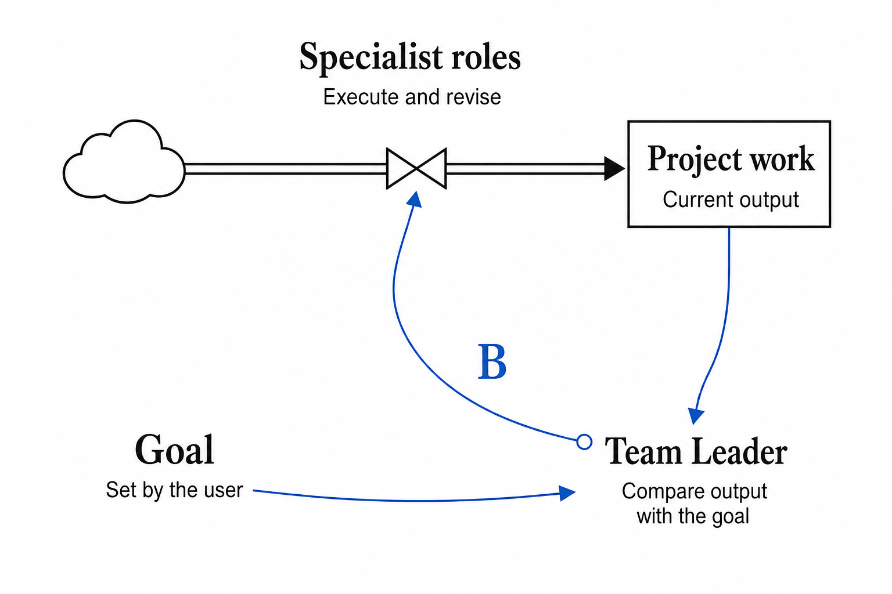

[English](README.md) · [繁體中文](README.zh-Hant.md) · [简体中文](README.zh-CN.md)

**Codex · Astra** | **v0.5.18** | **MIT**

[Install latest](#start) · [Update](#update) · [Use](#use) · [Change history](CHANGELOG.md) · [How it works](#loop) · [Feedback](#feedback)

**Does your AI project still need you to restate the goal, check the results, and prompt the next step?**

I designed Team Leader to give ongoing coordination to an AI lead with explicit responsibilities. It organizes specialist work around your goal, examines the results, and coordinates corrections. Project files preserve agreed requirements, decisions, and progress so work can continue with context.

It is intended for continuing projects that span product design, technical design, development, and review. Reducing the user's coordination burden is a design aim; broader evidence of outcomes is still needed.

**Current formal release: [0.5.18](https://github.com/aidesign996/team-leader/releases/latest) · 2026-09-09.** Reuse existing professional owners first, including across projects. Suitable solo work and complete visible teams remain distinct arrangements. [Changes and upgrade requirements](CHANGELOG.md).

## Install the latest release

Give this instruction to an AI tool with web and file access:

> Read https://github.com/aidesign996/team-leader, check the latest stable release at https://github.com/aidesign996/team-leader/releases/latest, and install its complete Team Leader Skill package. Tell me the version actually installed.

The host must support installing and reading Skills. Complete any required permissions or settings when prompted. Use the formal release ZIP, not the development branch or only `SKILL.md`.

Manual installation

1. Open the [latest formal release](https://github.com/aidesign996/team-leader/releases/latest). Under Assets, download `team-leader-VERSION.zip` and extract the complete `team-leader` folder.
2. Put it in your personal `~/.agents/skills/` or the project's `.agents/skills/`, preserving references, templates, and relative paths. Avoid an extra nested folder.
3. Select Team Leader or mention `$team-leader` in a project conversation. Confirm that it can read the version in `SKILL.md`; reopen the conversation or restart Codex if it is not discovered. This release includes 21 Skill files and an MIT license.

## Already installed? Update it explicitly

**Publishing a release does not automatically update your installed Skill.**

> Check Team Leader's latest formal release. Back up the old package and custom changes, then update the complete Skill. Preserve project records, accepted decisions, and unfinished work. Check the installed version, have the existing lead adopt relevant changes, and continue toward the original goal.

Read the [change history](CHANGELOG.md) since your installed version, including impact and upgrade requirements. Compare custom changes before merging them. Installation and the rules actually adopted by a project are separate states; record adoption after migration.

## Hand over the project in one sentence

Select Team Leader or mention `$team-leader` in your project conversation, then say:

> You're in charge of this project now. Please take it forward.

The lead should recover the goal, existing context, and unfinished work, then arrange the next step. It asks for essential missing requirements while you focus on making the result better.

**Reuse an appropriate existing professional owner, including a lead in another project.**

Cross-project work requires communication tools and access to the necessary materials. When a new team is needed, ask: “Please establish the complete team for this project and coordinate its work.” With authorization, establish six visible responsibilities and activate those needed for each task. Suitable solo work can deliver a complete result; existing professional ownership remains in place.

## How it works: goal, feedback, action

The design draws on balancing feedback in *Thinking in Systems*. The user defines the goal, the lead observes results and identifies the gap, and specialist roles take action. The updated results return for another check.

The lead coordinates who does the work and keeps checking whether it advances the goal. Early work can explore alternatives before converging against the goal and constraints. A lead alone does not guarantee stability: observations, feedback timing, and completed corrections matter.

## One lead, five specialist responsibilities

| Role | Responsibility |
| --- | --- |
| **0 · Team Leader** | Maintain the goal, assign work, identify gaps, and coordinate delivery. |
| **1 · Environment setup** | Prepare and check reproducible working conditions. |
| **2 · Product design** | Clarify needs, workflows, and user experience. |
| **3 · Technical design** | Define architecture, interfaces, and implementation boundaries. |
| **4 · Development** | Build, self-check, and correct. |
| **5 · Independent AI review** | Check results through a role that did not produce that work. |

In team mode, establish all six visible responsibilities when authorized, then activate the roles needed for each task. Map these responsibilities to the actual deliverable, including research, assessments, reports, and services. The lead also organizes requirements, product and technical decisions, progress, and experience into findable project documents. Records must be read and applied in later work; saving them alone is not automatic memory.

## Fit and effort

- **Primarily designed around Astra in Codex.** Sol has some specialist-role experience, but there is no comparable evaluation of a complete Sol team.
- **Multi-role work can use substantial quota.** The lead typically starts at XHigh, selects specialist effort for the task, and manages context when supported. Actual settings follow user preferences and host capabilities.
- **Simple tasks can remain solo.** Package integrity, extraction into a clean directory, and basic structure were checked. A complete first run on a new account, long-term correction, and quota savings have not been evaluated systematically.

[Read the full design article on GitHub](https://github.com/aidesign996/ai-practice/blob/main/docs/team-leader/ARTICLE.en.md) · [Release notes and checksums](https://github.com/aidesign996/team-leader/releases/latest)

## Bring back a real work situation

**One message is enough:** what you were doing, what actually happened, and what would have worked better. The model and a relevant output excerpt can help explain the issue; remove private information before sharing.

For example: “I asked the lead to take over an existing project. It wrote another plan but did not resume unfinished work. I would prefer it to recover the continuation point, finish that work, and then propose changes.” This is an illustrative feedback scenario.

[View public GitHub discussions](https://github.com/aidesign996/ai-practice/discussions/1) · [Leave a comment in the shared thread](https://aidesign996.github.io/ai-practice/article-team-leader.html#comments)

The website's English, Traditional Chinese, and Simplified Chinese editions use the same discussion mapping. Comments remain public in their original language. I will use real situations to review the method and describe completed changes in future release notes.

---

The Team Leader Skill uses the [MIT License](team-leader/LICENSE), credited to AI Design 996. Article text and illustrations are separate. [Design references](SOURCES.md)
