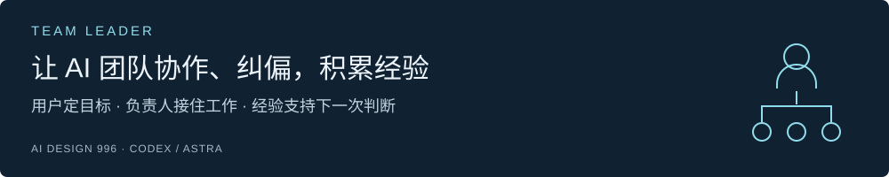
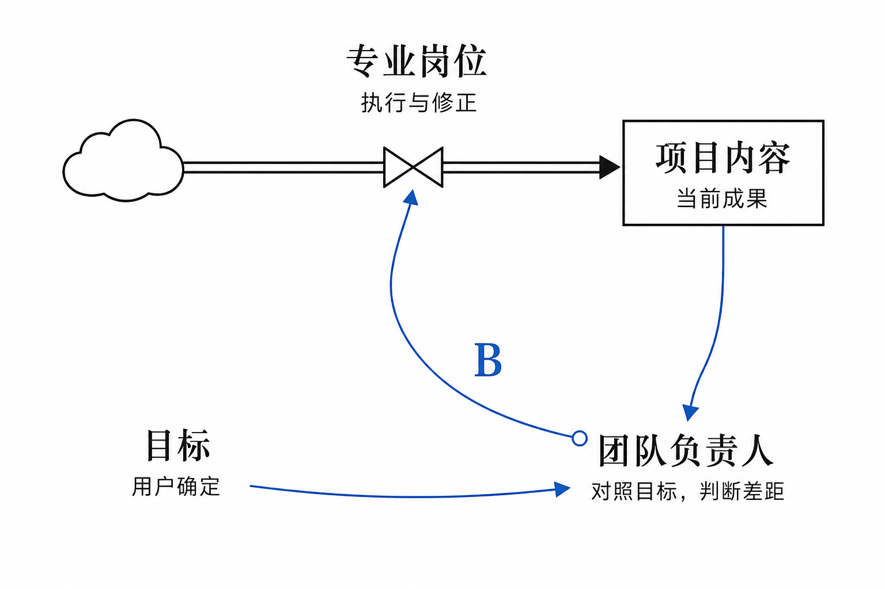

[English](README.md) · [繁體中文](README.zh-Hant.md) · [简体中文](README.zh-CN.md)

**Codex · Astra** ｜ **v0.5.23** ｜ **MIT**

[安装最新版](#start) · [更新已安装版本](#update) · [开始使用](#use) · [更新记录](CHANGELOG.md) · [设计原理](#loop) · [反馈](#feedback)

**做 AI 项目时，你是否还要反复提醒目标、检查结果，再催下一步？**

我设计了 Team Leader，把持续协调项目这件事交给一位职责明确的 AI 负责人：它围绕你的目标安排专业岗位，检查做出来的结果，并组织修正。已经确认的需求、决定和进度则保存到项目文件中，方便后续接着做。

它面向需要持续迭代、跨产品设计、技术设计、开发和验证的项目。希望减少使用者反复转述和协调的负担；实际效果仍需要更多场景验证。

**当前正式版：[0.5.23](https://github.com/aidesign996/team-leader/releases/latest) · 2026-09-10。** 以用户目标为尺度，区分必须遵守的要求与可调整的经验；按当前条件借鉴案例，并从结果修正做法。[变化与升级要求](CHANGELOG.md)。

## 安装最新版

把下面这句话交给支持联网和文件操作的 AI 工具：

> 请阅读 https://github.com/aidesign996/team-leader/blob/main/README.zh-CN.md，从 https://github.com/aidesign996/team-leader/releases/latest 核对最新正式发布，下载该版本的完整 Team Leader Skill 并安装。完成后告诉我实际安装的版本。

工具需要能安装和读取 Skill；涉及权限或设置时，按提示完成。默认取正式发行的完整 ZIP，不直接使用开发分支，也不要只复制 `SKILL.md`。

手动安装：展开查看

1. 打开[最新正式发行](https://github.com/aidesign996/team-leader/releases/latest)，在 Assets 中下载 `team-leader-版本号.zip`，解压得到完整的 `team-leader` 文件夹。
2. 个人使用放到 `~/.agents/skills/`；只供当前项目使用则放到项目的 `.agents/skills/`。保留方法参考、模板与相对路径，不要额外套一层同名文件夹。
3. 在项目对话中选中 Team Leader，或点名 `$team-leader`，确认它能读取 `SKILL.md` 中的版本。未发现时重新打开对话或重启 Codex。本版公开包包含21个 Skill 文件和1个 MIT 许可证。

## 已经装过，怎么更新？

**发布新版，不会自动替换你已经安装的 Skill。**

> 请核对 Team Leader 的最新正式发布。先备份旧技能包和自定义修改，再更新完整 Skill；保留项目资料、已确认决定和未完成任务。更新后核对本地版本，让原负责人读取适用变化，接着原来的目标做。

从正式发行页查看本地版本之后的[更新记录](CHANGELOG.md)，尤其留意使用影响和升级要求。不要直接覆盖自己的改动；需要保留的内容应先比较再合并。安装版本与项目实际采用的规则可以暂时不同，完成迁移后再记录。

## 装好后，一句话交代项目

在项目对话中选中 Team Leader，或先点名 `$team-leader`，然后说：

> 这件事交给你负责，帮我持续跟进。过程中有用的经验留下来，以后遇到类似事情，先找来看看怎么用。

负责人应先找回目标、已有资料和未完成工作，再安排下一步。缺少关键需求时主动问你；你可以继续补充想法，讨论怎样把结果做好。

**已有合适的专业负责人，就优先找他承接，包括其他项目的负责人。**

跨项目协作需要工具支持负责人之间通信，并允许访问任务所需资料。需要新建团队时，可以明确说：“请为这个项目建立完整团队，由你负责协调。”获得授权后补齐六类可见职责，每轮只调动有关岗位；合适的单人任务可以完整交付，已有专业归属仍应保留。

## 它怎样带队：目标、反馈、行动

设计受到《系统之美》的调节反馈启发：用户确定目标，负责人观察结果并判断差距，专业岗位据此行动，再把新的结果带回检查。

负责人既要安排谁来做，也要持续判断“这轮工作有没有让项目更接近目标”。早期可以探索多个方案，进入实现时再依据目标与约束收敛。新增负责人并不自动保证稳定，观察质量、反馈及时性和修正落实同样重要。

## 让经验帮助下一次判断

“让读者容易懂”是目标，“分段、加粗”是某次的办法。下次满页都在加粗，负责人应比较条件，可能反而减少强调。留下目标、条件、选择理由和实际结果，经验才有助于新的判断。这个例子用于解释思路，并非效果实验。

**目标与有效要求必须遵守；旧案例可以调整。** 有新结果就修订原经验，让下一次查找用得上。这不等于重新训练模型，也不保证长期自动无遗漏。

## 一个负责人，五类专业职责

| 角色 | 负责什么 |
| --- | --- |
| **0 · 团队负责人** | 围绕用户目标安排工作，检查差距并协调交付。 |
| **1 · 环境配置** | 准备和检查可复现的工作条件。 |
| **2 · 产品设计** | 明确需求、使用流程与体验。 |
| **3 · 技术设计** | 设计架构、接口和实现边界。 |
| **4 · 开发** | 实现、自查与修正。 |
| **5 · 独立 AI 验收** | 由未参与该项制作的角色检查结果。 |

采用团队模式且获得授权后补齐六类可见职责，每轮只调动相关岗位。这些职责也适配研究、评审、报告与持续服务，按实际成果用途分工。负责人还会组织项目文档，让需求、产品方案、技术方案、进度和经验各有可查找的位置。记录需要在后续任务中主动读取和应用，保存文件本身不等于自动记住。

## 适用范围与投入

- **主要设计对象是 Codex 中的 Astra。** Sol 有部分专业岗位实践，尚无同条件下完整 Sol 团队的效果结论。
- **可能消耗较多额度。** 用户明确的模型与档位优先；获准自动分配时，负责人通常以 high 为起点，专业岗位按任务复杂度选择投入，验证与实际风险相称。
- **简单任务可以保持单人。** 当前已检查包完整性、干净目录解压与基础结构；新账号完整首次运行、长期自主纠偏和节省额度尚未系统验证。

[阅读完整设计文章（GitHub）](https://github.com/aidesign996/ai-practice/blob/main/docs/team-leader/ARTICLE.md) · [查看版本说明与校验文件](https://github.com/aidesign996/team-leader/releases/latest)

## 欢迎把工作中遇到的问题带回来

**不需要先写一份规范报告，一条留言说清楚就好：** 你在做什么、它实际怎样处理、你希望怎样处理会更好。模型和输出片段有助于理解问题，分享前可去掉私人信息。

例如：“我让负责人接手一个已有项目，它重新拟了计划，却没接着做上一轮未完成的事。我更希望它先找到继续点，完成后再提出调整。”这是说明反馈方式的假设场景。

[查看 GitHub 公开讨论](https://github.com/aidesign996/ai-practice/discussions/1) · [在现有共享评论区留言](https://aidesign996.github.io/ai-practice/article-team-leader.zh.html#comments)

网站英文、繁体、简体版本共用同一讨论映射，留言以原语言公开显示。我会结合真实场景整理反馈，改进方法，并在后续版本说明里交代已做的调整。

---

Team Leader Skill 采用 [MIT 许可](team-leader/LICENSE)，署名 AI Design 996。文章与配图单独提供。[设计参考](SOURCES.md)
