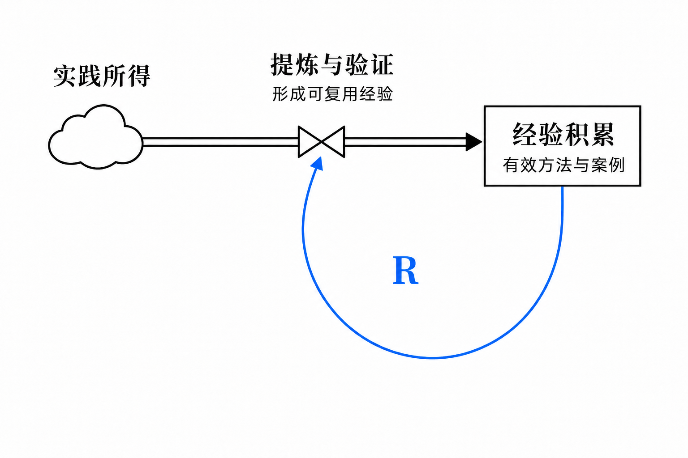
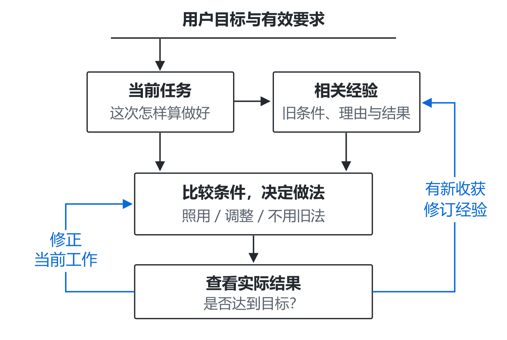
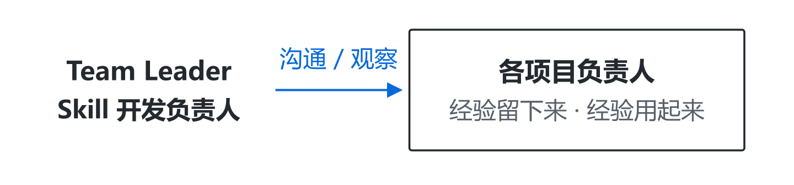
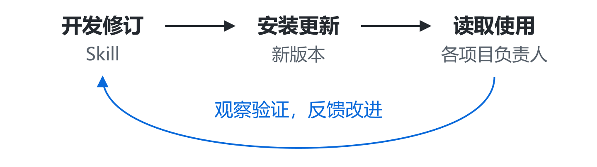

[English](README.md) · [繁體中文](README.zh-Hant.md) · [简体中文](README.zh-CN.md)

**Codex · Astra** ｜ **v0.5.24** ｜ **MIT**

[安装最新版](#start) · [更新已安装版本](#update) · [开始使用](#use) · [工作原理](#loop) · [监督与迭代](#iteration) · [反馈](#feedback)

**Team Leader 是一套以 Skill 为载体的 AI 团队工作方法：围绕用户目标组织工作，通过反馈修正成果，让负责人直接协作，并把经验用于下一次判断。**

你提出目标、决定重要取舍；负责人接住组织与交付的责任。维护这套 Skill 时，也可以让开发负责人跟进实际使用，发现设计与执行之间的差距，再组织改进。我们希望减少你盯进度、来回传话、反复教和逐项检查的负担。

## 它怎样帮你把事情做好

- **围绕目标完成工作。** 明确岗位贡献，查看实际成果与要求的差距，组织修正，再检查改后的结果。
- **连接需要配合的负责人。** 在项目内组织专业分工，也可以联系其他项目已有的负责人，交换问题和资料，把回应用进当前任务。
- **积累经验，再用好经验。** 保存当时的条件、选择理由和结果；下次检索相似案例，比较条件后决定怎样借鉴，再根据新结果修订。
- **跟进使用，改进方法。** 维护 Skill 的开发负责人结合使用方反馈与实际工作，检查规则有没有落实，组织修订，再跟进更新后的效果。

这些安排共同服务于完整交付，适用于需要持续迭代的项目、研究、报告与实践工作。简单任务可以由一人完成；跨项目通信与观察需要所在应用提供工具和访问权限。越用越顺手是设计目标，长期效果还需要真实场景检验。

[阅读完整设计文章：协作、纠偏与经验积累](https://aidesign996.github.io/ai-practice/article-team-leader.zh.html)

**当前正式版：[0.5.24](https://github.com/aidesign996/team-leader/releases/latest) · 2026-09-11。** 认准当前未完工作，让经验条件进入实际决定；沿用有效授权，修后回看整体成果。[变化与升级要求](CHANGELOG.md)。

## 安装最新版

把下面这句话交给支持联网和文件操作的 AI 工具：

> 请阅读 <https://github.com/aidesign996/team-leader/blob/main/README.zh-CN.md>，从 https://github.com/aidesign996/team-leader/releases/latest 核对最新正式发布，下载该版本的完整 Team Leader Skill 并安装。完成后告诉我实际安装的版本。

工具需要能安装和读取 Skill；涉及权限或设置时，按提示完成。默认取正式发行的完整 ZIP，不直接使用开发分支，也不要只复制 `SKILL.md`。

手动安装：展开查看

1. 打开[最新正式发行](https://github.com/aidesign996/team-leader/releases/latest)，在 Assets 中下载 `team-leader-版本号.zip`，解压得到完整的 `team-leader` 文件夹。
2. 个人使用放到 `~/.agents/skills/`；只供当前项目使用则放到项目的 `.agents/skills/`。保留方法参考、模板与相对路径，不要额外套一层同名文件夹。
3. 在项目对话中选中 Team Leader，或点名 `$team-leader`，确认它能读取 `SKILL.md` 中的版本。未发现时重新打开对话或重启 Codex。本版公开包包含21个 Skill 文件和1个 MIT 许可证。

## 已经装过，怎么更新？

**发布新版，不会自动替换你已经安装的 Skill。**

> 请核对 Team Leader 的最新正式发布。先备份旧技能包和自定义修改，再更新完整 Skill；保留项目资料、已确认决定和未完成任务。更新后核对本地版本，让原负责人读取适用变化，接着原来的目标做。

从正式发行页查看本地版本之后的[更新记录](CHANGELOG.md)，尤其留意使用影响和升级要求。不要直接覆盖自己的改动；需要保留的内容应先比较再合并。安装版本与项目实际采用的规则可以暂时不同，完成迁移后再记录。

## 装好后，一句话交代项目

在项目对话中选中 Team Leader，或先点名 `$team-leader`，然后说：

> 这件事交给你负责，帮我持续跟进。过程中有用的经验留下来，以后遇到类似事情，先找来看看怎么用。

负责人应先找回目标、已有资料和未完成工作，再安排下一步。缺少关键需求时主动问你；你可以继续补充想法，讨论怎样把结果做好。

**已有合适的专业负责人，就优先找他承接，包括其他项目的负责人。**

跨项目协作需要工具支持负责人之间通信，并允许访问任务所需资料。需要新建团队时，可以明确说：“请为这个项目建立完整团队，由你负责协调。”获得授权后补齐六类可见职责，每轮只调动有关岗位；合适的单人任务可以完整交付，已有专业归属仍应保留。

## 两种反馈：修正成果，积累经验

设计借鉴《系统之美》的反馈思想，两种回路各有作用：

- **调节回路：用目标检查成果。** 负责人对照用户目标找出差距，协调专业岗位修正，再检查新的结果。
- **增强回路：让经验支持后续积累。** 已有经验帮助提炼与验证，新形成的有效经验再充实积累。经验需要筛选与修订，避免反复强化错误解释。

上图说明调节回路：用反馈缩小成果与目标的差距。

上面的增强回路解释另一种作用：已有经验帮助提炼与验证，新形成的有效经验再充实积累。这是工作方法的设计思路，尚未建立可计算的系统动力学模型，也不表示 AI 能力会自动持续增长。

早期可以探索和比较多个方案，再按目标与约束选择实现方向。负责人需要查看真实成果，不能只凭完成报告判断目标已经达到。

## 让经验帮助下一次判断

### 先比较条件，再决定怎样做

接到新任务，先恢复用户目标、岗位职责和有效要求，再从经验入口检索类似案例。比较旧案例为什么这样选、这次的条件有什么不同，决定照用、调整或不用旧方法。

图中两条回程各有用途：**问题仍在，就修正当前工作；有新收获，再修订原经验。** 用户反馈与 AI 的实际尝试都能提供线索，尚未验证的解释仍作为假设。

例如，“让读者容易懂”是目标，“分段、加粗”是某次的办法。重点被埋住时，可以单独分段、少量加粗；下次满页都在加粗，反而需要减少强调。同一目标，可以导向不同做法。这个例子用于解释判断方法，并非效果实验。

### 分清内容，放到固定入口

Skill 规定资料的读取与更新方式，项目文件保存具体内容。有效要求与案例经验分别保存，通过入口关联；负责人按当前问题查找相关内容。

| 内容 | 保存入口 | 保存什么 |
| --- | --- | --- |
| 共同规则 | `AGENTS.md` | 读取资料与协作的约定。 |
| 岗位职责 | `roles/` | 各岗位的责任和目标。 |
| 有效约定 | 产品、技术与验收文档 | 已确认的要求和决定。 |
| 案例经验 | `docs/METHODOLOGY.md` | 经验索引，链接方法、案例与结果。 |
| 当前状态 | `README.md`、`PROGRESS.md` | 未完成工作和下一步。 |

表中是随包模板的知识分工；已有项目可以沿用自己的有效入口。案例留下当时的条件、选择理由、实际结果和适用边界，后续有新证据就更新原记录，无关或重复内容不必另存一份。

**值得沉淀的，是能帮助后续判断的做法或教训。** 成功和失败都可能提供经验；未经验证的解释先注明假设。经验入口链接到具体记录，后续有新证据就修订原案例，让下一次找到的是可比较、可追溯的内容。

**目标与有效要求必须遵守；旧案例可以调整。** 一次性要求在本次执行，不自动变成长期规则。保存文件之后，还要在工作中实际检索、比较和应用；这不等于重新训练模型，也不保证长期自动无遗漏。

## 监督实际使用，让 Skill 持续改进

写进 Skill 的设计，还要看有没有落实。比如要求负责人积累经验，就要检查：有用的经验是否保存，后续相似工作是否真的借用了它。

开发负责人既与使用方沟通，也在已有权限内查看原有工作记录与成果。观察时不提前提示具体检查点，更容易看到平时怎样做。负责人说“做了”，还需要实际工作支持。

发现差距后，区分执行遗漏、资料难找和规则不清。项目内的问题在项目内纠正；共同方法的问题交回 Skill 修订，由开发负责人组织修改并跟进效果。

更新后，让各项目负责人读取适用变化，继续原来的工作。先观察它能否依据新规则主动调整相关安排，再检查后续任务是否实际用上。**安装完成、回复已读、主动调整、持续用好，是不同层次的证据。**

如果你也在维护一套 Skill，可以向开发负责人交代：

> 帮我跟进这套 Skill 的实际使用。结合使用方反馈和实际工作，看看哪些设计没有做到，提出改进，并跟进更新后的效果。

说明可以访问哪些项目、联系哪些负责人，以及本次允许的修改范围；结合具体问题、重要成果或版本更新安排检查。单独安装 Skill 不会自动建立后台监控。

**用户定目标、把方向；开发负责人持续观察、验证和改进。** 这里迭代的是 Skill 和工作方法，让使用中的问题进入下一轮修订。已有局部采用和修订记录，长期能否减少提醒、稳定改善效果，还需要继续验证。[查看完整分析与实践](https://aidesign996.github.io/ai-practice/article-team-leader.zh.html#section-6)

## 一个负责人，五类专业职责

| 角色 | 负责什么 |
| --- | --- |
| **0 · 团队负责人** | 围绕用户目标安排工作，检查差距并协调交付。 |
| **1 · 环境配置** | 准备和检查可复现的工作条件。 |
| **2 · 产品设计** | 明确需求、使用流程与体验。 |
| **3 · 技术设计** | 设计架构、接口和实现边界。 |
| **4 · 开发** | 实现、自查与修正。 |
| **5 · 独立 AI 验收** | 由未参与该项制作的角色检查结果。 |

采用团队模式且获得授权后补齐六类可见职责，每轮只调动相关岗位。这些职责也适配研究、评审、报告与持续服务，按实际成果用途分工。负责人还会组织项目文档，让需求、产品方案、技术方案、进度和经验各有可查找的位置。记录需要在后续任务中主动读取和应用，保存文件本身不等于自动记住。

## 适用范围与投入

- **主要设计对象是 Codex 中的 Astra。** Sol 有部分专业岗位实践，尚无同条件下完整 Sol 团队的效果结论。
- **可能消耗较多额度。** 用户明确的模型与档位优先；获准自动分配时，负责人通常以 high 为起点，专业岗位按任务复杂度选择投入，验证与实际风险相称。
- **简单任务可以保持单人。** 当前已检查包完整性、干净目录解压与基础结构；新账号完整首次运行、长期自主纠偏和节省额度尚未系统验证。
- **监督与迭代也需要投入。** 读取记录、定位问题、修订和验证都会消耗资源，应围绕具体差距安排，复用未变化的证据，避免为了检查而反复检查。

[阅读完整设计文章（GitHub）](https://github.com/aidesign996/ai-practice/blob/main/docs/team-leader/ARTICLE.md) · [查看版本说明与校验文件](https://github.com/aidesign996/team-leader/releases/latest)

## 欢迎把工作中遇到的问题带回来

**不需要先写一份规范报告，一条留言说清楚就好：** 你在做什么、它实际怎样处理、你希望怎样处理会更好。模型和输出片段有助于理解问题，分享前可去掉私人信息。

例如：“我让负责人接手一个已有项目，它重新拟了计划，却没接着做上一轮未完成的事。我更希望它先找到继续点，完成后再提出调整。”这是说明反馈方式的假设场景。

[查看 GitHub 公开讨论](https://github.com/aidesign996/ai-practice/discussions/1) · [在现有共享评论区留言](https://aidesign996.github.io/ai-practice/article-team-leader.zh.html#comments)

网站英文、繁体、简体版本共用同一讨论映射，留言以原语言公开显示。我会结合真实场景整理反馈，改进方法，并在后续版本说明里交代已做的调整。

---

Team Leader Skill 采用 [MIT 许可](team-leader/LICENSE)，署名 AI Design 996。文章与配图单独提供。[设计参考](SOURCES.md)
