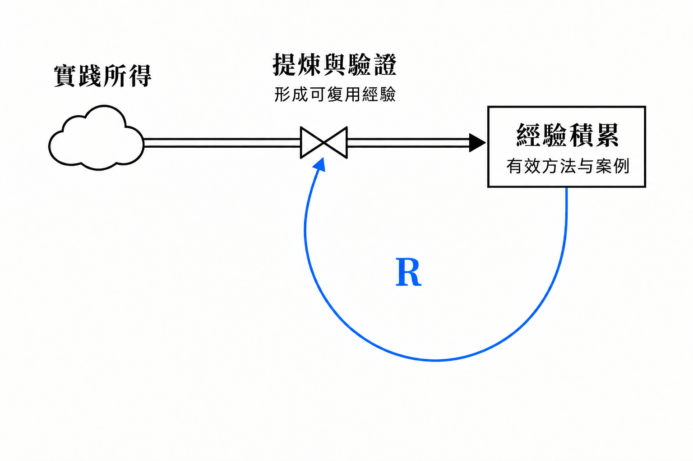
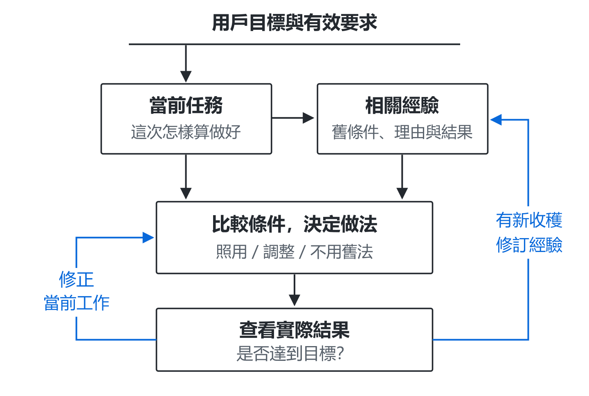
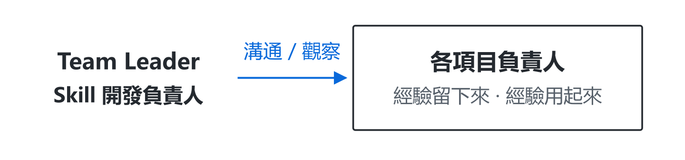
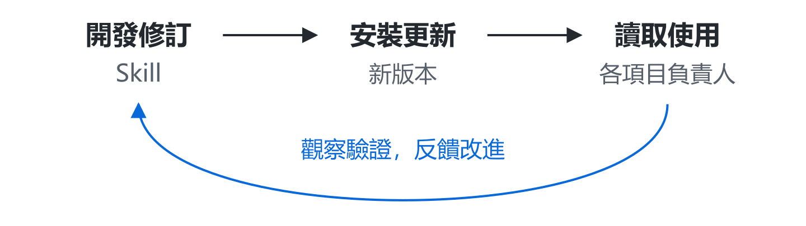

[English](README.md) · [繁體中文](README.zh-Hant.md) · [简体中文](README.zh-CN.md)

**Codex · Astra** ｜ **v0.5.24** ｜ **MIT**

[安裝最新版](#start) · [更新已安裝版本](#update) · [開始使用](#use) · [工作原理](#loop) · [監督與迭代](#iteration) · [反饋](#feedback)

**Team Leader 是一套以 Skill 為載體的 AI 團隊工作方法：圍繞用戶目標組織工作，通過反饋修正成果，讓負責人直接協作，並把經驗用於下一次判斷。**

你提出目標、決定重要取捨；負責人接住組織與交付的責任。維護這套 Skill 時，也可以讓開發負責人跟進實際使用，發現設計與執行之間的差距，再組織改進。我們希望減少你盯進度、來回傳話、反覆教和逐項檢查的負擔。

## 它怎樣幫你把事情做好

- **圍繞目標完成工作。** 明確崗位貢獻，查看實際成果與要求的差距，組織修正，再檢查改後的結果。
- **連接需要配合的負責人。** 在項目內組織專業分工，也可以聯繫其他項目已有的負責人，交換問題和資料，把回應用進當前任務。
- **積累經驗，再用好經驗。** 保存當時的條件、選擇理由和結果；下次檢索相似案例，比較條件後決定怎樣借鑑，再根據新結果修訂。
- **跟進使用，改進方法。** 維護 Skill 的開發負責人結合使用方反饋與實際工作，檢查規則有沒有落實，組織修訂，再跟進更新後的效果。

這些安排共同服務於完整交付，適用於需要持續迭代的項目、研究、報告與實踐工作。簡單任務可以由一人完成；跨項目通信與觀察需要所在應用提供工具和訪問權限。越用越順手是設計目標，長期效果還需要真實場景檢驗。

[閱讀完整設計文章：協作、糾偏與經驗積累](https://aidesign996.github.io/ai-practice/article-team-leader.zh-hant.html)

**當前正式版：[0.5.24](https://github.com/aidesign996/team-leader/releases/latest) · 2026-09-11。** 認準當前未完工作，讓經驗條件進入實際決定；沿用有效授權，修後回看整體成果。[變化與升級要求](CHANGELOG.md)。

## 安裝最新版

把下面這句話交給支持聯網和文件操作的 AI 工具：

> 請閱讀 <https://github.com/aidesign996/team-leader/blob/main/README.zh-Hant.md>，從 https://github.com/aidesign996/team-leader/releases/latest 核對最新正式發佈，下載該版本的完整 Team Leader Skill 並安裝。完成後告訴我實際安裝的版本。

工具需要能安裝和讀取 Skill；涉及權限或設置時，按提示完成。默認取正式發行的完整 ZIP，不直接使用開發分支，也不要只複製 `SKILL.md`。

手動安裝：展開查看

1. 打開[最新正式發行](https://github.com/aidesign996/team-leader/releases/latest)，在 Assets 中下載 `team-leader-版本號.zip`，解壓得到完整的 `team-leader` 文件夾。
2. 個人使用放到 `~/.agents/skills/`；只供當前項目使用則放到項目的 `.agents/skills/`。保留方法參考、模板與相對路徑，不要額外套一層同名文件夾。
3. 在項目對話中選中 Team Leader，或點名 `$team-leader`，確認它能讀取 `SKILL.md` 中的版本。未發現時重新打開對話或重啟 Codex。本版公開包包含21個 Skill 文件和1個 MIT 許可證。

## 已經裝過，怎麼更新？

**發佈新版，不會自動替換你已經安裝的 Skill。**

> 請核對 Team Leader 的最新正式發佈。先備份舊技能包和自定義修改，再更新完整 Skill；保留項目資料、已確認決定和未完成任務。更新後核對本地版本，讓原負責人讀取適用變化，接著原來的目標做。

從正式發行頁查看本地版本之後的[更新記錄](CHANGELOG.md)，尤其留意使用影響和升級要求。不要直接覆蓋自己的改動；需要保留的內容應先比較再合併。安裝版本與項目實際採用的規則可以暫時不同，完成遷移後再記錄。

## 裝好後，一句話交代項目

在項目對話中選中 Team Leader，或先點名 `$team-leader`，然後說：

> 這件事交給你負責，幫我持續跟進。過程中有用的經驗留下來，以後遇到類似事情，先找來看看怎麼用。

負責人應先找回目標、已有資料和未完成工作，再安排下一步。缺少關鍵需求時主動問你；你可以繼續補充想法，討論怎樣把結果做好。

**已有合適的專業負責人，就優先找他承接，包括其他項目的負責人。**

跨項目協作需要工具支持負責人之間通信，並允許訪問任務所需資料。需要新建團隊時，可以明確說：“請為這個項目建立完整團隊，由你負責協調。”獲得授權後補齊六類可見職責，每輪只調動有關崗位；合適的單人任務可以完整交付，已有專業歸屬仍應保留。

## 兩種反饋：修正成果，積累經驗

設計借鑑《系統之美》的反饋思想，兩種迴路各有作用：

- **調節迴路：用目標檢查成果。** 負責人對照用戶目標找出差距，協調專業崗位修正，再檢查新的結果。
- **增強迴路：讓經驗支持後續積累。** 已有經驗幫助提煉與驗證，新形成的有效經驗再充實積累。經驗需要篩選與修訂，避免反覆強化錯誤解釋。

上圖說明調節迴路：用反饋縮小成果與目標的差距。

上面的增強迴路解釋另一種作用：已有經驗幫助提煉與驗證，新形成的有效經驗再充實積累。這是工作方法的設計思路，尚未建立可計算的系統動力學模型，也不表示 AI 能力會自動持續增長。

早期可以探索和比較多個方案，再按目標與約束選擇實現方向。負責人需要查看真實成果，不能只憑完成報告判斷目標已經達到。

## 讓經驗幫助下一次判斷

### 先比較條件，再決定怎樣做

接到新任務，先恢復用戶目標、崗位職責和有效要求，再從經驗入口檢索類似案例。比較舊案例為什麼這樣選、這次的條件有什麼不同，決定照用、調整或不用舊方法。

圖中兩條回程各有用途：**問題仍在，就修正當前工作；有新收穫，再修訂原經驗。** 用戶反饋與 AI 的實際嘗試都能提供線索，尚未驗證的解釋仍作為假設。

例如，“讓讀者容易懂”是目標，“分段、加粗”是某次的辦法。重點被埋住時，可以單獨分段、少量加粗；下次滿頁都在加粗，反而需要減少強調。同一目標，可以導向不同做法。這個例子用於解釋判斷方法，並非效果實驗。

### 分清內容，放到固定入口

Skill 規定資料的讀取與更新方式，項目文件保存具體內容。有效要求與案例經驗分別保存，通過入口關聯；負責人按當前問題查找相關內容。

| 內容 | 保存入口 | 保存什麼 |
| --- | --- | --- |
| 共同規則 | `AGENTS.md` | 讀取資料與協作的約定。 |
| 崗位職責 | `roles/` | 各崗位的責任和目標。 |
| 有效約定 | 產品、技術與驗收文檔 | 已確認的要求和決定。 |
| 案例經驗 | `docs/METHODOLOGY.md` | 經驗索引，鏈接方法、案例與結果。 |
| 當前狀態 | `README.md`、`PROGRESS.md` | 未完成工作和下一步。 |

表中是隨包模板的知識分工；已有項目可以沿用自己的有效入口。案例留下當時的條件、選擇理由、實際結果和適用邊界，後續有新證據就更新原記錄，無關或重複內容不必另存一份。

**值得沉澱的，是能幫助後續判斷的做法或教訓。** 成功和失敗都可能提供經驗；未經驗證的解釋先標明假設。經驗入口鏈接到具體記錄，後續有新證據就修訂原案例，讓下一次找到的是可比較、可追溯的內容。

**目標與有效要求必須遵守；舊案例可以調整。** 一次性要求在本次執行，不自動變成長期規則。保存文件之後，還要在工作中實際檢索、比較和應用；這不等於重新訓練模型，也不保證長期自動無遺漏。

## 監督實際使用，讓 Skill 持續改進

寫進 Skill 的設計，還要看有沒有落實。比如要求負責人積累經驗，就要檢查：有用的經驗是否保存，後續相似工作是否真的借用了它。

開發負責人既與使用方溝通，也在已有權限內查看原有工作記錄與成果。觀察時不提前提示具體檢查點，更容易看到平時怎樣做。負責人說「做了」，還需要實際工作支持。

發現差距後，區分執行遺漏、資料難找和規則不清。項目內的問題在項目內糾正；共同方法的問題交回 Skill 修訂，由開發負責人組織修改並跟進效果。

更新後，讓各項目負責人讀取適用變化，繼續原來的工作。先觀察它能否依據新規則主動調整相關安排，再檢查後續任務是否實際用上。**安裝完成、回復已讀、主動調整、持續用好，是不同層次的證據。**

如果你也在維護一套 Skill，可以向開發負責人交代：

> 幫我跟進這套 Skill 的實際使用。結合使用方反饋和實際工作，看看哪些設計沒有做到，提出改進，並跟進更新後的效果。

說明可以訪問哪些項目、聯繫哪些負責人，以及本次允許的修改範圍；結合具體問題、重要成果或版本更新安排檢查。單獨安裝 Skill 不會自動建立後台監控。

**用戶定目標、把方向；開發負責人持續觀察、驗證和改進。** 這裡迭代的是 Skill 和工作方法，讓使用中的問題進入下一輪修訂。已有局部採用和修訂記錄，長期能否減少提醒、穩定改善效果，還需要繼續驗證。[查看完整分析與實踐](https://aidesign996.github.io/ai-practice/article-team-leader.zh-hant.html#section-6)

## 一個負責人，五類專業職責

| 角色 | 負責什麼 |
| --- | --- |
| **0 · 團隊負責人** | 圍繞用戶目標安排工作，檢查差距並協調交付。 |
| **1 · 環境配置** | 準備和檢查可復現的工作條件。 |
| **2 · 產品設計** | 明確需求、使用流程與體驗。 |
| **3 · 技術設計** | 設計架構、接口和實現邊界。 |
| **4 · 開發** | 實現、自查與修正。 |
| **5 · 獨立 AI 驗收** | 由未參與該項製作的角色檢查結果。 |

採用團隊模式且獲得授權後補齊六類可見職責，每輪只調動相關崗位。這些職責也適配研究、評審、報告與持續服務，按實際成果用途分工。負責人還會組織項目文檔，讓需求、產品方案、技術方案、進度和經驗各有可查找的位置。記錄需要在後續任務中主動讀取和應用，保存文件本身不等於自動記住。

## 適用範圍與投入

- **主要設計對象是 Codex 中的 Astra。** Sol 有部分專業崗位實踐，尚無同條件下完整 Sol 團隊的效果結論。
- **可能消耗較多額度。** 用戶明確的模型與檔位優先；獲准自動分配時，負責人通常以 high 為起點，專業崗位按任務複雜度選擇投入，驗證與實際風險相稱。
- **簡單任務可以保持單人。** 當前已檢查包完整性、乾淨目錄解壓與基礎結構；新賬號完整首次運行、長期自主糾偏和節省額度尚未系統驗證。
- **監督與迭代也需要投入。** 讀取記錄、定位問題、修訂和驗證都會消耗資源，應圍繞具體差距安排，複用未變化的證據，避免為了檢查而反覆檢查。

[閱讀完整原理與實踐](https://aidesign996.github.io/ai-practice/article-team-leader.zh-hant.html) · [查看版本說明與校驗文件](https://github.com/aidesign996/team-leader/releases/latest)

## 歡迎把工作中遇到的問題帶回來

**不需要先寫一份規範報告，一條留言說清楚就好：** 你在做什麼、它實際怎樣處理、你希望怎樣處理會更好。模型和輸出片段有助於理解問題，分享前可去掉私人信息。

例如：“我讓負責人接手一個已有項目，它重新擬了計劃，卻沒接著做上一輪未完成的事。我更希望它先找到繼續點，完成後再提出調整。”這是說明反饋方式的假設場景。

[查看 GitHub 公開討論](https://github.com/aidesign996/ai-practice/discussions/1) · [在現有共享評論區留言](https://aidesign996.github.io/ai-practice/article-team-leader.zh-hant.html#comments)

網站英文、繁體、簡體版本共用同一討論映射，留言以原語言公開顯示。我會結合真實場景整理反饋，改進方法，並在後續版本說明裡交代已做的調整。

---

Team Leader Skill 採用 [MIT 許可](team-leader/LICENSE)，署名 AI Design 996。文章與配圖單獨提供。[設計參考](SOURCES.md)
