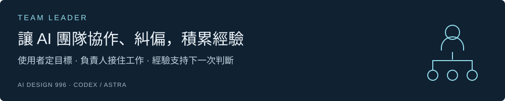
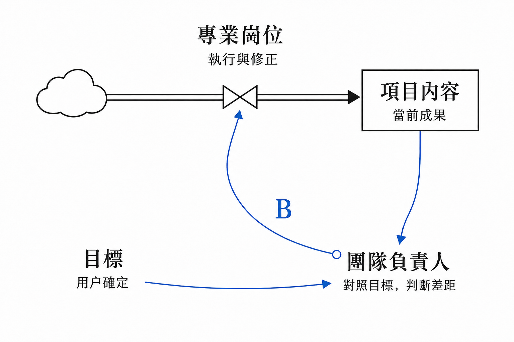

[English](README.md) · [繁體中文](README.zh-Hant.md) · [简体中文](README.zh-CN.md)

**Codex · Astra** ｜ **v0.5.23** ｜ **MIT**

[安裝最新版](#start) · [更新已安裝版本](#update) · [開始使用](#use) · [更新記錄](CHANGELOG.md) · [設計原理](#loop) · [反饋](#feedback)

**做 AI 項目時，你是否還要反覆提醒目標、檢查結果，再催下一步？**

我設計了 Team Leader，把持續協調項目這件事交給一位職責明確的 AI 負責人：它圍繞你的目標安排專業崗位，檢查做出來的結果，並組織修正。已經確認的需求、決定和進度則保存到項目文件中，方便後續接著做。

它面向需要持續迭代、跨產品設計、技術設計、開發和驗證的項目。希望減少使用者反覆轉述和協調的負擔；實際效果仍需要更多場景驗證。

**當前正式版：[0.5.23](https://github.com/aidesign996/team-leader/releases/latest) · 2026-09-10。** 以用戶目標為尺度，區分必須遵守的要求與可調整的經驗；按當前條件借鑑案例，並從結果修正做法。[變化與升級要求](CHANGELOG.md)。

## 安裝最新版

把下面這句話交給支持聯網和文件操作的 AI 工具：

> 請閱讀 https://github.com/aidesign996/team-leader/blob/main/README.zh-Hant.md，從 https://github.com/aidesign996/team-leader/releases/latest 核對最新正式發佈，下載該版本的完整 Team Leader Skill 並安裝。完成後告訴我實際安裝的版本。

工具需要能安裝和讀取 Skill；涉及權限或設置時，按提示完成。默認取正式發行的完整 ZIP，不直接使用開發分支，也不要只複製 `SKILL.md`。

手動安裝：展開查看

1. 打開[最新正式發行](https://github.com/aidesign996/team-leader/releases/latest)，在 Assets 中下載 `team-leader-版本號.zip`，解壓得到完整的 `team-leader` 文件夾。
2. 個人使用放到 `~/.agents/skills/`；只供當前項目使用則放到項目的 `.agents/skills/`。保留方法參考、模板與相對路徑，不要額外套一層同名文件夾。
3. 在項目對話中選中 Team Leader，或點名 `$team-leader`，確認它能讀取 `SKILL.md` 中的版本。未發現時重新打開對話或重啟 Codex。本版公開包包含21個 Skill 文件和1個 MIT 許可證。

## 已經裝過，怎麼更新？

**發佈新版，不會自動替換你已經安裝的 Skill。**

> 請核對 Team Leader 的最新正式發佈。先備份舊技能包和自定義修改，再更新完整 Skill；保留項目資料、已確認決定和未完成任務。更新後核對本地版本，讓原負責人讀取適用變化，接著原來的目標做。

從正式發行頁查看本地版本之後的[更新記錄](CHANGELOG.md)，尤其留意使用影響和升級要求。不要直接覆蓋自己的改動；需要保留的內容應先比較再合併。安裝版本與項目實際採用的規則可以暫時不同，完成遷移後再記錄。

## 裝好後，一句話交代項目

在項目對話中選中 Team Leader，或先點名 `$team-leader`，然後說：

> 這件事交給你負責，幫我持續跟進。過程中有用的經驗留下來，以後遇到類似事情，先找來看看怎麼用。

負責人應先找回目標、已有資料和未完成工作，再安排下一步。缺少關鍵需求時主動問你；你可以繼續補充想法，討論怎樣把結果做好。

**已有合適的專業負責人，就優先找他承接，包括其他項目的負責人。**

跨項目協作需要工具支持負責人之間通信，並允許訪問任務所需資料。需要新建團隊時，可以明確說：“請為這個項目建立完整團隊，由你負責協調。”獲得授權後補齊六類可見職責，每輪只調動有關崗位；合適的單人任務可以完整交付，已有專業歸屬仍應保留。

## 它怎樣帶隊：目標、反饋、行動

設計受到《系統之美》的調節反饋啟發：用戶確定目標，負責人觀察結果並判斷差距，專業崗位據此行動，再把新的結果帶回檢查。

負責人既要安排誰來做，也要持續判斷“這輪工作有沒有讓項目更接近目標”。早期可以探索多個方案，進入實現時再依據目標與約束收斂。新增負責人並不自動保證穩定，觀察質量、反饋及時性和修正落實同樣重要。

## 讓經驗幫助下一次判斷

“讓讀者容易懂”是目標，“分段、加粗”是某次的辦法。下次滿頁都在加粗，負責人應比較條件，可能反而減少強調。留下目標、條件、選擇理由和實際結果，經驗才有助於新的判斷。這個例子用於解釋思路，並非效果實驗。

**目標與有效要求必須遵守；舊案例可以調整。** 有新結果就修訂原經驗，讓下一次查找用得上。這不等於重新訓練模型，也不保證長期自動無遺漏。

## 一個負責人，五類專業職責

| 角色 | 負責什麼 |
| --- | --- |
| **0 · 團隊負責人** | 圍繞用戶目標安排工作，檢查差距並協調交付。 |
| **1 · 環境配置** | 準備和檢查可復現的工作條件。 |
| **2 · 產品設計** | 明確需求、使用流程與體驗。 |
| **3 · 技術設計** | 設計架構、接口和實現邊界。 |
| **4 · 開發** | 實現、自查與修正。 |
| **5 · 獨立 AI 驗收** | 由未參與該項製作的角色檢查結果。 |

採用團隊模式且獲得授權後補齊六類可見職責，每輪只調動相關崗位。這些職責也適配研究、評審、報告與持續服務，按實際成果用途分工。負責人還會組織項目文檔，讓需求、產品方案、技術方案、進度和經驗各有可查找的位置。記錄需要在後續任務中主動讀取和應用，保存文件本身不等於自動記住。

## 適用範圍與投入

- **主要設計對象是 Codex 中的 Astra。** Sol 有部分專業崗位實踐，尚無同條件下完整 Sol 團隊的效果結論。
- **可能消耗較多額度。** 用戶明確的模型與檔位優先；獲准自動分配時，負責人通常以 high 為起點，專業崗位按任務複雜度選擇投入，驗證與實際風險相稱。
- **簡單任務可以保持單人。** 當前已檢查包完整性、乾淨目錄解壓與基礎結構；新賬號完整首次運行、長期自主糾偏和節省額度尚未系統驗證。

[閱讀完整設計文章（GitHub）](https://github.com/aidesign996/ai-practice/blob/main/docs/team-leader/ARTICLE.zh-Hant.md) · [查看版本說明與校驗文件](https://github.com/aidesign996/team-leader/releases/latest)

## 歡迎把工作中遇到的問題帶回來

**不需要先寫一份規範報告，一條留言說清楚就好：** 你在做什麼、它實際怎樣處理、你希望怎樣處理會更好。模型和輸出片段有助於理解問題，分享前可去掉私人信息。

例如：“我讓負責人接手一個已有項目，它重新擬了計劃，卻沒接著做上一輪未完成的事。我更希望它先找到繼續點，完成後再提出調整。”這是說明反饋方式的假設場景。

[查看 GitHub 公開討論](https://github.com/aidesign996/ai-practice/discussions/1) · [在現有共享評論區留言](https://aidesign996.github.io/ai-practice/article-team-leader.zh-hant.html#comments)

網站英文、繁體、簡體版本共用同一討論映射，留言以原語言公開顯示。我會結合真實場景整理反饋，改進方法，並在後續版本說明裡交代已做的調整。

---

Team Leader Skill 採用 [MIT 許可](team-leader/LICENSE)，署名 AI Design 996。文章與配圖單獨提供。[設計參考](SOURCES.md)
